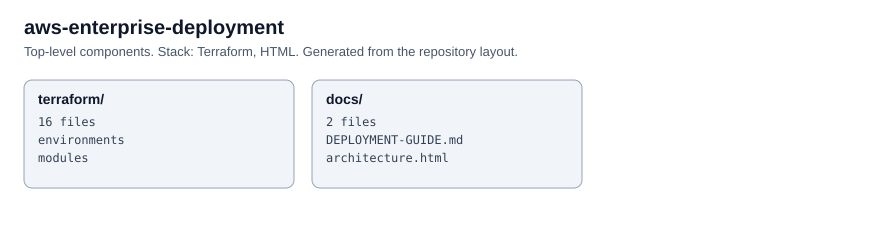

# AWS Enterprise Multi-Tier Cloud Deployment
### Architect: Kehinde (Kenny) Samson Ogunlowo | Senior Multi-Cloud DevSecOps Architect

## Overview
Production-grade, security-hardened AWS deployment using Terraform IaC. Built on real-world patterns
from BP Refinery, Patterson UTI, and Mammoth Energy Services. Implements a Zero Trust network 
architecture with EKS, RDS Multi-AZ, CloudFront CDN, WAFv2, and full observability stack.

## Architecture
```
Internet → Route 53 → CloudFront (WAF) → ALB (Public Subnets)
                                           ↓
                              EKS Cluster (Private Subnets)
                              ├── App Node Group (m5.xlarge)
                              ├── ML Node Group (g4dn.xlarge)  
                              └── System Node Group (t3.medium)
                                           ↓
                              ┌────────────────────────┐
                              │   Data Layer           │
                              │  RDS Aurora Multi-AZ   │
                              │  ElastiCache Redis     │
                              │  S3 (Encrypted)        │
                              └────────────────────────┘
                                           ↓
                              VPC Flow Logs → S3 → Athena
                              GuardDuty → Security Hub → SNS
```

## Terraform Modules
| Module | Purpose | Compliance |
|--------|---------|-----------|
| vpc | 3-AZ VPC, public/private/data subnets | NIST 800-53 SC-7 |
| eks | EKS 1.29 with IRSA, OIDC, Karpenter | CIS EKS Benchmark |
| rds | Aurora PostgreSQL Multi-AZ, encrypted | HIPAA §164.312 |
| s3 | Versioned, encrypted, lifecycle policies | SOC 2 CC6 |
| waf | OWASP managed rules + custom rate limits | OWASP Top 10 |
| iam | Least-privilege roles, permission boundaries | CMMC AC-6 |

## Deploy
```bash
cd terraform/environments/prod
terraform init -backend-config=backend.hcl
terraform workspace new prod
terraform plan -var-file=prod.tfvars
terraform apply -auto-approve
```

<!-- architecture -->
## Architecture


